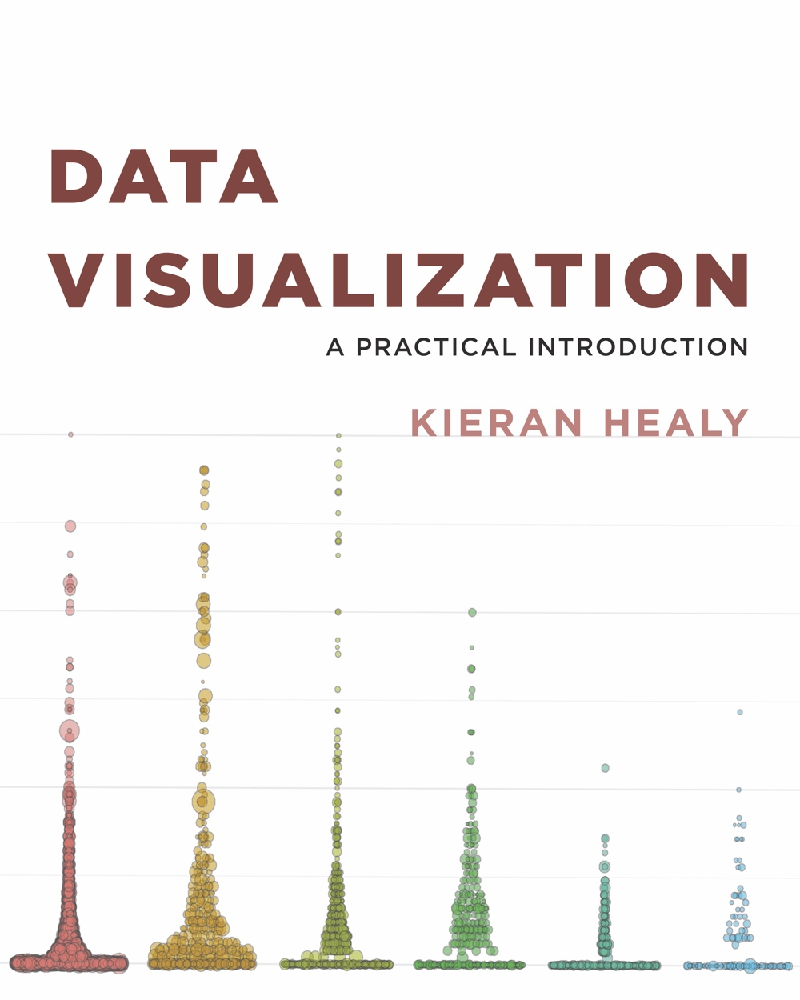

# dataviz

## Kieran Healy

Support files for _[Data Visualization: A Practical Introduction](http://socviz.co)_ and courses taught from it. This repo is an RStudio project and contains a series of RMarkdown files organized in parallel to the book's chapters. The code for almost all the figures is provided, along with space for your own notes. A more general note-taking template can be found in the `template/` folder.

With R and RStudio installed, students can use this repo via the `usethis` package. From the R console, 

`> install.packages("usethis", repos = "http://cran.rstudio.com")`

Then:

`library(usethis)`

`use_course("https://github.com/kjhealy/dataviz/archive/master.zip")`

or

`use_course("goo.gl/jiPYYk")`

## About _[Data Visualization: A Practical Introduction](http://socviz.co)_

_Data Visualization: A Practical Introduction_ teaches you data visualization using R and ggplot2 in a clear, sensible, and reproducible way. It is published by Princeton University Press.  

You can purchase the book [from Amazon](https://amzn.to/2vfAixM), [from Powell's](http://www.powells.com/book/-9780691181622), or [from the Publisher](https://press.princeton.edu/titles/13826.html). 

Through a series of worked examples, the book shows you how to build plots piece by piece, beginning with scatterplots and summaries of single variables, then moving on to more complex graphics. Topics covered include plotting continuous and categorical variables, layering information on graphics; faceting grouped data to produce effective “small multiple” plots; transforming data to easily produce visual summaries on the graph such as trend lines, linear fits, error ranges, and boxplots; creating maps, and also some alternatives to maps worth considering when presenting country- or state-level data. Plotting estimates from statistical models and from complex survey designs are also covered. The book then explores the process of refining plots to accomplish common tasks such as highlighting key features of the data, labeling particular items of interest, annotating plots, and changing their overall appearance. Finally, it discusses some strategies for presenting graphical results in different formats, and to different sorts of audiences.

Learning how to visualize data effectively is more than just knowing how to write code that produces figures from data. This book will teach you how to do that. But it will also teach you how to think about the information you want to show, and how to consider the audience you are showing it to—including the most common case, when the audience is yourself.
